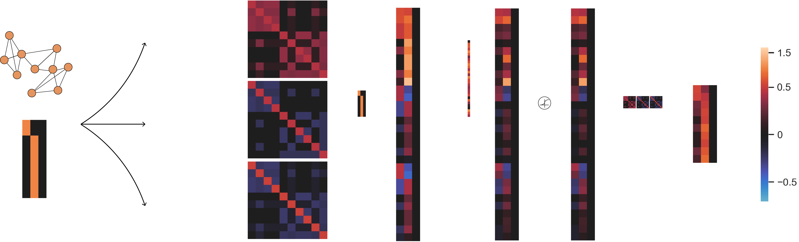
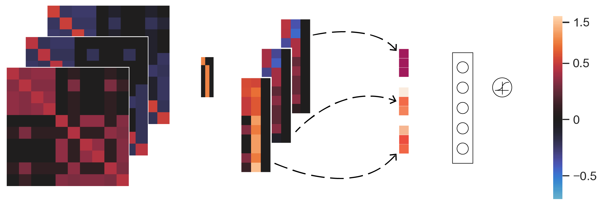

# How Framelets Enhance Graph Neural Networks

This repository is the official implementation of [How Framelets Enhance Graph Neural Networks](https://arxiv.org/abs/2102.06986).



The above figure shows **framelet convolution**



The above figure shows **framelet pooling** 

## Requirements

To install requirements:

```
pip install -r requirements.txt
```

## Node Classification - UFGConv
To reproduce the results in Table 1 of the main text, you can use the following command

```
python UFGConv_relu.py --dataset Cora
```
for ReLU model. To reproduce the results for shrinkage model, please run the following script.

```
python UFGConv_shrinkage.py --dataset Cora
```
The above two commands are for Cora. To reproduce the experiment results for the other datasets, you can change the argument of --dataset to Citeseer or Pubmed. Other hyperparameters include: --lr, --wd, --nhid, --Lev, --s, --dropout. Please note that the default values of these hyperparameters are only for Cora. 

## Graph Classification - UFGPool
To reproduce the results in Table 3 of the main text, you can use the following command:

```
python UFGPool.py --dataset PROTEINS
```
Other hyperparameters include: --lr, --wd, --nhid, --Lev, --s, --dropout.

## Citation 
If you consider our codes and datasets useful, please cite:
```
@inproceedings{ma2020path,
  title={How Framelets Enhance Graph Neural Networks},
  author={Zheng, Xuebin and Zhou, Bingxin and Gao, Junbin and Wang, Yu Guang and Lio, Pietro and Li, Ming and Montufar, Guido},
  booktitle={ICML},
  year={2021}
}
```

## Contributing
Copyright (c) <2020>

Permission is hereby granted, free of charge, to any person obtaining a copy of this software and associated documentation files (the "Software"), to deal in the Software without restriction, including without limitation the rights to use, copy, modify, merge, publish, distribute, sublicense, and/or sell copies of the Software, and to permit persons to whom the Software is furnished to do so, subject to the following conditions:

The above copyright notice and this permission notice shall be included in all copies or substantial portions of the Software.

THE SOFTWARE IS PROVIDED "AS IS", WITHOUT WARRANTY OF ANY KIND, EXPRESS OR IMPLIED, INCLUDING BUT NOT LIMITED TO THE WARRANTIES OF MERCHANTABILITY, FITNESS FOR A PARTICULAR PURPOSE AND NONINFRINGEMENT. IN NO EVENT SHALL THE AUTHORS OR COPYRIGHT HOLDERS BE LIABLE FOR ANY CLAIM, DAMAGES OR OTHER LIABILITY, WHETHER IN AN ACTION OF CONTRACT, TORT OR OTHERWISE, ARISING FROM, OUT OF OR IN CONNECTION WITH THE SOFTWARE OR THE USE OR OTHER DEALINGS IN THE SOFTWARE.
